# Mid-term report

## Introduction

We are conducting our machine learning project on automated essay scoring(AES), based on a Kaggle competition where the goal is to evaluate the essays of 8th-12th grade English as second language learners. In accordance with the competition and its description, we will be predicting six analytic measures for each essay, namely: cohesion, syntax, vocabulary, phraseology, grammar, and conventions. We plan to use a popular pre-trained general language model BERT and utilizing its output to train our own model (or potentially models) on the Kaggle data. The dataset contains 3911 essays with a mean of 461 words.

## Problem definition & Data collection

We are conducting our machine learning project on essay grading, based on a Kaggle competition where the goal is to evaluate the essays of 8th-12th grade English as second language learners. 

**Model Input**

Input for the models that we will build are the student's essays provided by the competition. The dataset contains 3911 essays with a mean of 461 words.

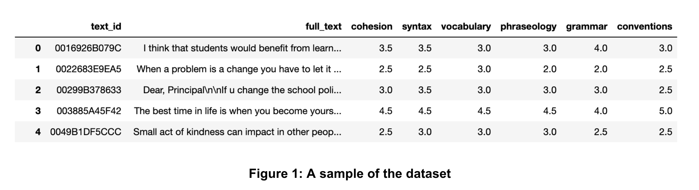
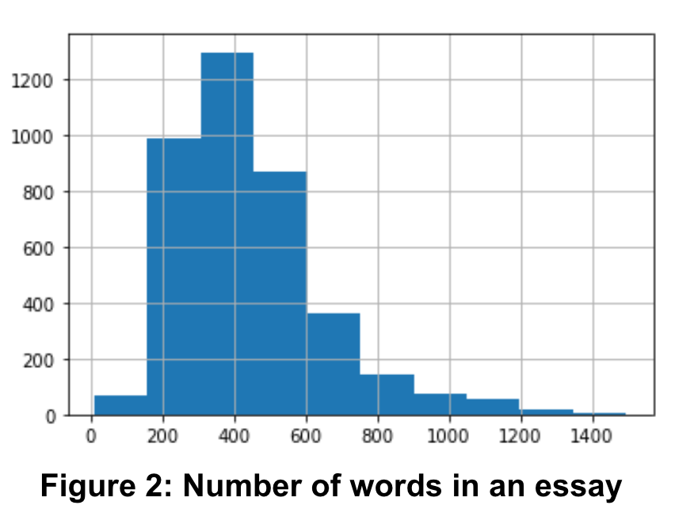

**Prediction output**

In accordance with the competition and its description, we will be predicting six analytic measures for each essay, namely: `cohesion`, `syntax`, `vocabulary`, `phraseology`, `grammar`, and `conventions`. 

## Methods

AES is a relevant and applicable usage of Machine Learning as it can tangibly save hours required to manually grade essays. Our scoring algorithm will be particularly useful as it will score essays on specific dimensions, something that has lagged automatic “Holistic” or general scoring of essays(Ke 2019). This application is also particularly relevant as it allows graders/teachers to provide specific and more actionable feedback to students on their essay grades. 

Our project is NLP (Natural Language Processing) focused, where we will utilize TL (Transfer Learning), and apply BERT (Bidirectional Encoder Representations from Transformers). TL means that we will reuse the pre-trained model and apply a new problem statement to it. NLP, as a branch of Artificial Intelligence, is making computers have the ability to process text like humans.

Therefore, BERT stands out for our projects because BERT is a transformer-based technique for NLP applications. It is a pre-trained language model which helps machines learn excellent representations of text concerning the context in many natural language tasks. It utilizes a bidirectional encoder to contextualize the sentence from Left-to-Right and Right-to-Left. We plan to apply BERT as a pre-trained model and add downstream layers to predict the metric scores.

(Wang 2022) Highlights the fact that despite BERT being a very popular and state of the art NLP tool, it along with other pre-trained models have been historically under-used for the purpose of automated essay scoring. (Wang 2022) also defines several limitations of BERT for AES and proposes techniques to remediate these weaknesses. Among these techniques is the suggestion to use transfer learning from out-of-domain essays to combat a lack of data to properly train BERT. Thus we decided to try applying BERT in concert with transfer learning in order to construct a multi-dimensional AES model, a (to the best of our knowledge) novel application that could make good use of BERT’s sentence contextualization and compensate for its weaknesses. 

Additionally, we will conduct a comparison between our main BERT model and several additional models including RNN (Recurrent Neural Network) based models and traditional ML models (e.g. Tree models, SVM (Support Vector Machine), etc.) with hand designed features to evaluate the efficacy of our main model. 

Once we’ve finished with developing our BERT model, we plan on clustering essays into different meaningful categories based on their scores in each of the analytic measures. This will not only provide us insight on the data, but also potentially give teachers a way to give more customized feedback to students even if they’re not directly involved in the scoring process.

Our final result will be two models: our BERT model, that will predict the six analytic measures as its output, as well as one that is able to perform clustering on the dataset, putting students into contextually meaningful clusters.
 
We evaluate the performance of our Supervised model using the mean column wise root mean squared error(MCRMSE), since it is the metric used for scoring in the competition. Additionally, we will evaluate the clusters generated by our clustering algorithm to ensure they are contextually relevant. Please note that we will not be using Quadratic Weighted Kappa Score (mentioned in the proposal) as one of the metrics for evaulating our models. This metrics is used for evaulating categorical responses and thus is not a right fit for this use case. We can modify our continuous score but it will not be an accurate evaluation.

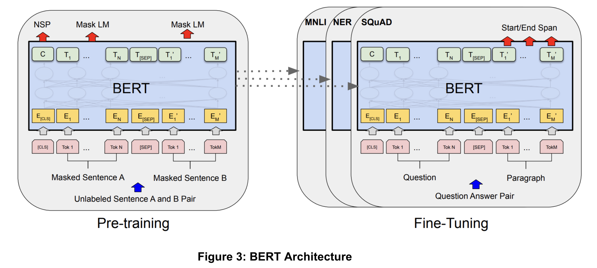

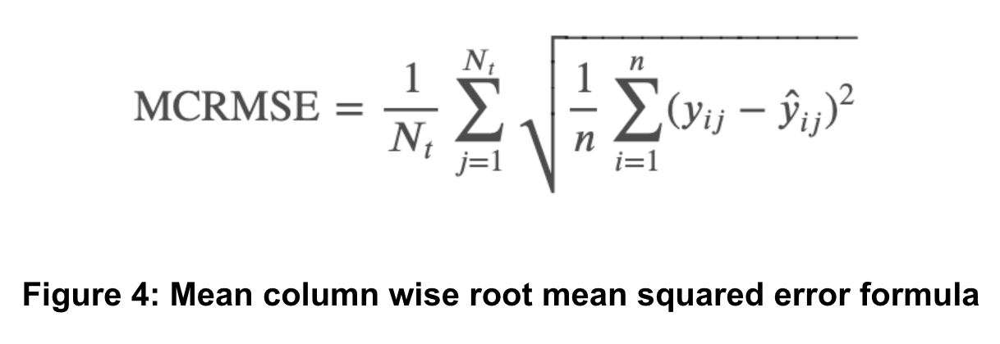

  

## Implementation, Result, and Discussion

At this point in our midterm report, we have built several models using two approaches: 
1. Classical approach: Hand-picked features + traditional ml algorithms (Linear regression, Lasso, Gradient Boosted Tree)
2. RNN approach: Using Recurrent neural network to extract latent features and multi layer perceptrons (MLP) to predict score.

Trying these approaches before deep-diving on Transformer-based model have the following benefit:
- We understand better the task at hand (essay scoring) and its main challenges
- We understand what works well and what doesn't for the classical approach and the alternative approach, which provide good ideas for the transformer-based model

We will report the implementation, result, and discussion of each approaches separately. 

### A. Classical approach
#### 1. Data Preprocessing
By using the LanguageTools library in Python, we were able to quantify and categorize the mistakes in each essay. The library inputted the raw essay text and outputted the number of mistakes in a broad set of categories, including Grammar, Confused Words, Colocations, Redundancy, Style, American English Style, Nonstandard Phrases, Typos, Casing, Semantics, Typography, Miscellaneous, British English, Compounding, and Punctuation. We proceeded to remove the categories American English Style, British English, and Semantics, because they were either not relevant to our essay scoring task or had an insignificant number of instances and would not provide meaningful information to our models. 

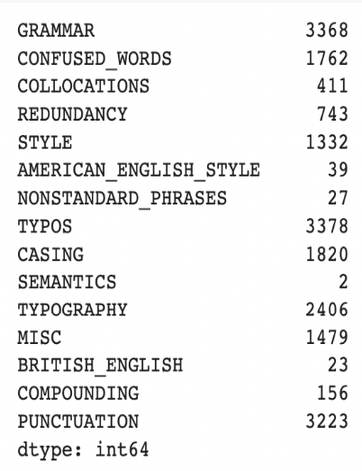

*Figure 5: Number of mistakes in the dataset*

#### 2. ML Model Implementation
We first attempted to predict essay scores without using a deep learning approach.  The predictors we used are the error counts obtained from the LanguageTools library. We created six models to predict each of the six responses (cohesion, syntax, vocabulary, phraseology, grammar, and conventions). Then, we created a seventh model to predict the average of these six responses (holistic score) as a baseline comparison. We then tested different models to predict the essay scores. For all of our testing, we split the data into training, validation, and testing. We also used Grid Search to optimize for various hyperparameters to obtain the best set for each model. We used RMSE as a performance metric. 

First, we tested Lasso Regression to establish baseline performance and to find insignificant features, and we found that Lasso only eliminated one or two variables in each model. We then tested XGBoost and Random Forest. The validation performances are shown in the table below. We found that XGBoost performed marginally better than Lasso and Random Forest across the different response variables. We also noted that Random Forest and XGBoost performed significantly better on predicting the holistic score than Lasso, and that these models predicted holistic score more accurately than the individual metrics. 

#### 3. Results
The validation model results are added below.

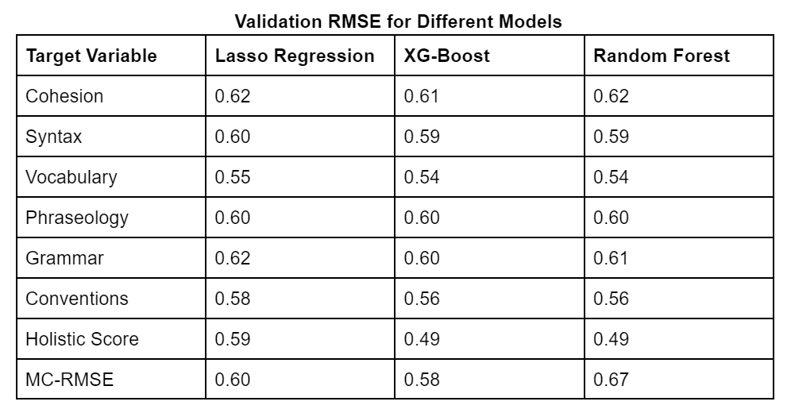

*Figure 6: Validation RMSE for different models*

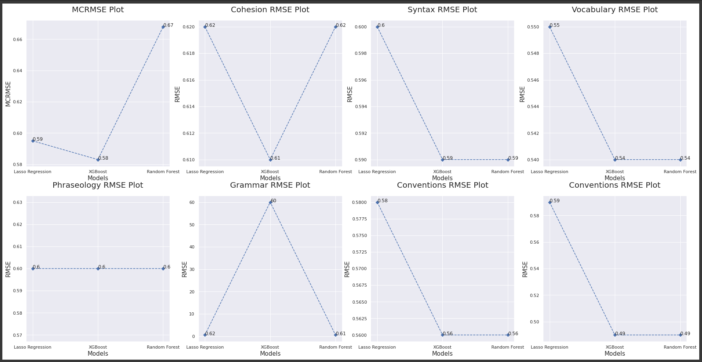

*Figure 7: Visualization of performance for individual score*

We selected XGBoost as our baseline model and will compare it to the RNN-based model and our future Transformer-based model. In the future, we will experiment further with the XGBoost model and see if we can improve it by incorporating text embedding data along with the LanguageTools data. 

### B. RNN-based approach
#### 1. Data pre-processing

After tokenization, we leveraged existing pre-trained word embeddings, specifically `glove-wiki-gigaword-200` embeddings as input for the GRU models. Using this embedding, each words is represented by a 200-dimensional vector. For the RNN-based approach, we didn't handle each typos separately, instead, all typos will be assigned to a trainable vector (initialized randomly). This way, the model can understand typo through learning.

#### 2. ML model implementation

As we have 6 different scores for each essay, we will build a multitask-learning model with 1 encoder and 6 different decoders. For the encoder, we choose to use Gated Recurrent Unit (GRU) over Long-short term memory (LSTM) as it has been demonstrated to be trained much faster with minimal or no sacrifice in performance. GRU can be stacked (similar to multi-layer perceptron) to enble the learning of more complex patterns. We employ dropout as the main regularization method for the GRU cells. For the decoders, we choose to use fully-connected multi-layer perceptron (MLP) because it is powerful and easy to train.

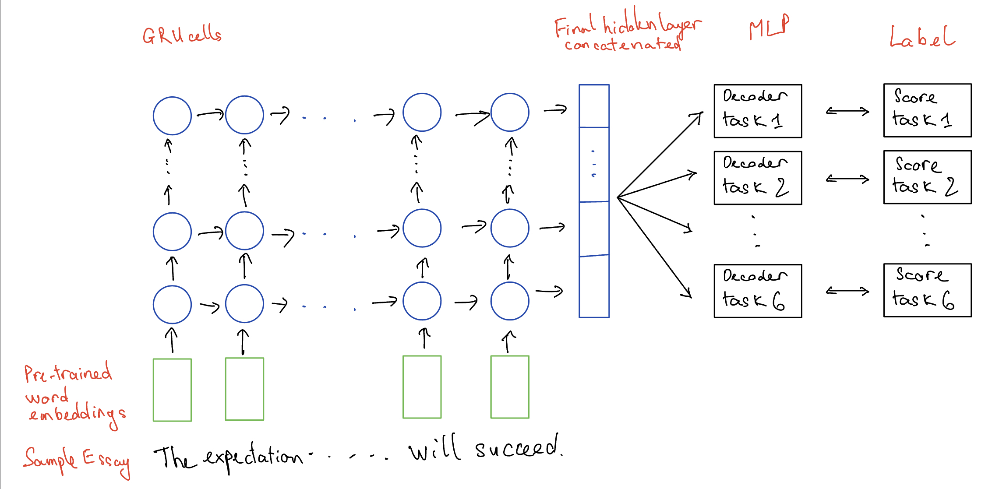

*Figure 8: Network architecture of the RNN model*

We implemented the model using Pytorch, with ReLU activation and mean squared error (MSE) as the loss function. The hyper-parameters for the model are: 
- `gru_size`: Size of the hidden layer output from each GRU cell
- `drop_prob`: Probability of dropout regularization for GRU
- `gru_num_layer`: Depth of the GRU components (how many layer of GRU being stacked)
- `decoder_depth`: Depth of the MLP decoders
- `decoder_size`: Size of each layer in the decoders

An early stopping mechanism was also employed using a validation set (split from the training set), training would stop if validation loss doesn't improve for 10 consecutive epochs. Training was performed on a commercial GPU, taking around 5-10 minutes to train before early stopping. Due to the constraints in computational power, we employ partial fractional design to test only the main effects of different choices.
#### 3. Results
We compare the model performance on MCRMSE. The test set reults for the models are shown below. 

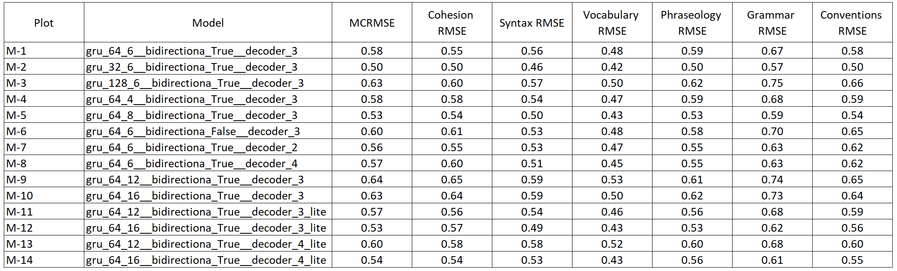

*Figure 9: Evaluation metrics of the RNN models*

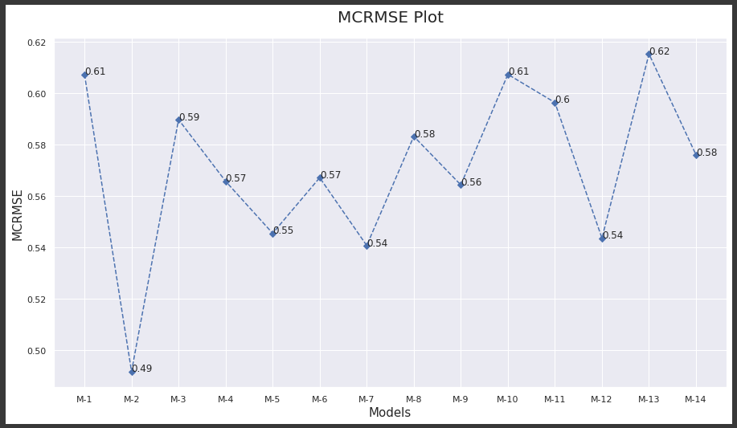

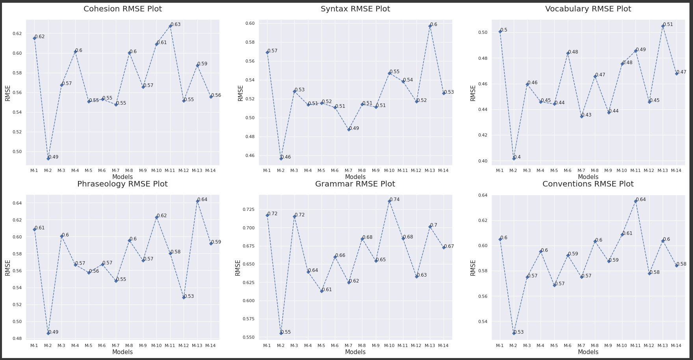

*Figure 10 & 11: Visualization of MCRMSE and RMSE of individual score for RNN models*

We observe that M-2 consistently performs better than the other models for all measures. There are a few models that performs well only on a few measures(M-1, M-5, M-12, M-14) whereas a few models perform poorly for all measures(M-9, M-10). We can also see that all models perform well in evaluating syntax and vocabulary but struggles when evaluating Phraseology and Grammar.

## Project planning

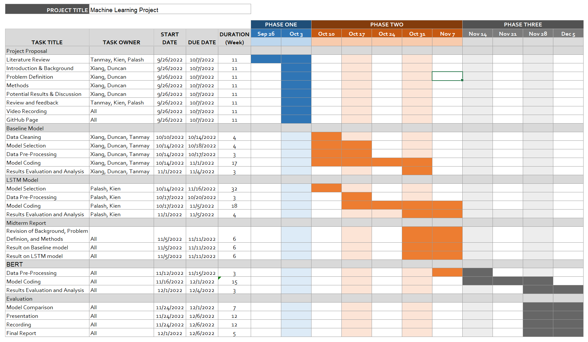

*Figure 12: Project planning timeline*

## Contribution table

| Phase | Name | Contribution |
| ----------- | ----------- | ----------- |
| Progress Report | Tanmay | Data Collection, Baseline Model Development, Evaluation |
| Progress Report | Palash | Data Cleaning and Processing, Evaluation, writing report for the same parts |
| Progress Report | Kien | Building, training and experiments of the RNN-based models, writing report for the same parts |
| Progress Report | Duncan | Methods, Baseline Model Development |
| Progress Report | Lily | Methods, Baseline Model Development |

  

## References

Ke, Z., & Ng, V. (2019). Automated Essay Scoring: A Survey of the State of the Art. IJCAI.

Devlin et al., NAACL (2019). BERT: Pre-training of Deep Bidirectional Transformers for Language Understanding

Wang et al., NAACL (2022). On the Use of Bert for Automated Essay Scoring: Joint Learning of Multi-Scale Essay Representation

Ruder et al., NAACL(2019).Transfer Learning in Natural Language Processing

Feedback prize - english language learning. Kaggle. (2022). Retrieved October 6, 2022, from https://www.kaggle.com/competitions/feedback-prize-english-language-learning/overview/evaluation 

Vaswani et al. Arxiv. (2017). Attention Is All You Need

Mathias, S., & Bhattacharyya, P. (2018, May). ASAP++: Enriching the ASAP automated essay grading dataset with essay attribute scores. In Proceedings of the eleventh international conference on language resources and evaluation (LREC 2018)

The Hewlett Foundation: Automated essay scoring. Kaggle. (2012). Retrieved October 6, 2022, from https://www.kaggle.com/competitions/asap-aes/overview/evaluation 
