# Introduction/Background
We conducted our machine learning project on automated essay scoring (AES), based on a Kaggle competition where the goal is to evaluate the essays of 8th -12th grade English as second language learners. In accordance with the competition and its description, we predicted six analytic measures for each essay, namely: cohesion, syntax, vocabulary, phraseology, grammar, and conventions. 

AES is a relevant and applicable usage of Machine Learning as it can tangibly save hours required to manually grade essays. Surveying research papers on this topic, we realized that specific-dimension grading models had lagged “Holistic” or general scoring models of essays (Ke 2019). Thus, this application is particularly relevant as it allows graders/teachers to provide specific and more actionable feedback to students on their essay grades.

The most relevant fundamental research field to AES is natural language processing (NLP). It has been developing significantly in the last decade due to the significant improvement in deep learning architectures, as well as the exponential increase in the amount of data and computational power. There are 3 common approaches to building machine learning models that work with text data: manually designed features, recurrent neural networks (RNN), and transformers. Among them, the BERT (Bidirectional Encoder Representations from Transformers) architecture has been the state-of-the-art method for the last few years. It is a pre-trained language model which helps machines learn excellent representations of text concerning the context in many natural language tasks. It utilizes a bidirectional encoder to contextualize the sentence from Left-to-Right and Right-to-Left.

(Wang 2022) Highlights the fact that despite BERT being an extremely popular and state-of-the-art NLP tool, it along with other pre-trained models has been historically under-used for the purpose of automated essay scoring. (Wang 2022) also defines several limitations of BERT for AES and proposes techniques to remediate these weaknesses. Among these techniques is the suggestion to use transfer learning from out-of-domain essays to combat a lack of data to professionally train BERT. 

Thus, we decided to apply BERT using transfer learning to construct a multi-dimensional AES model, (to the best of our knowledge) a novel application that could make effective use of BERT’s sentence contextualization and compensate for its weaknesses. We also built models that use manually designed features and RNN-based models for comparison. Lastly, we decided to run several Unsupervised Learning Clustering algorithms on the output of our BERT model in order to create meaningful groupings of students and their essays in order to provide meaningful student insights along with our predicted measures.

# Problem definition/Data Collection

**Model Input**

The input for the models that we will build is the student essays provided by the competition. The dataset contains 3911 essays with an average length of 461 words. The words per essay data is also positively skewed.

**Prediction output**

In accordance with the competition and its description, we will be predicting six analytic measures for each essay, namely: cohesion, syntax, vocabulary, phraseology, grammar, and conventions. We will also use clustering methods to attempt to generate meaningful groupings of students and their results.

# Methods
## 1. Supervised models
As we had 6 different scores for each essay, the methods we used for Supervised Learning could be analyzed in the “one encoder - multiple decoders” context:
- Classical machine learning models
    - Encoder: Essays were encoded by the number of errors in different categories
    - Decoders: Linear-regression models and tree-based models
- RNN-based models
    - Encoder: An RNN model
    - Decoders: Multi-Layer Perceptron (MLP) models
- BERT-based models
    - Encoder: Pre-trained BERT model
    - Decoder: We tried both classical machine learning models (linear regression, tree-based models), and MLP models

In the case of BERT-based models, we utilized Transfer Learning, meaning that we reused the pre-trained model and applied a new problem statement to it. 

We evaluate the performance of our Supervised model using the mean column wise root mean squared error(MCRMSE), since it is the metric used for scoring in the competition.

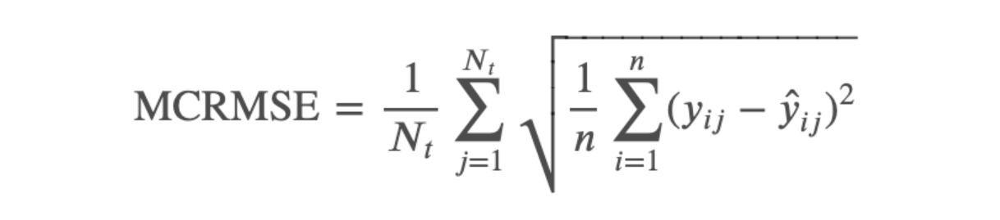

### A. Classical ML model
**Pre-processing:** By using the LanguageTools library in Python, we were able to quantify and categorize the mistakes in each essay. The library inputted the raw essay text and outputted the number of mistakes in a broad set of categories, including Grammar, Confused Words, Collocations, Redundancy, Style, American English Style, Nonstandard Phrases, Typos, Casing, Semantics, Typography, Miscellaneous, British English, Compounding, and Punctuation. We proceeded to remove the categories American English Style, British English, and Semantics because they were either not relevant to our essay scoring task or had an insignificant number of instances and would not provide meaningful information to our models. 

*Figure 3: Mistakes categories and corresponding counts*

**Modeling:** We first attempted to predict essay scores without using a deep learning approach.  The predictors we used here were the error counts obtained from the LanguageTools library. We created six models to predict each of the six responses (cohesion, syntax, vocabulary, phraseology, grammar, and conventions). Then, we created the seventh model to predict the average of these six responses (holistic score) as a baseline comparison. We then tested different models to predict the essay scores. For all of our testing, we split the data into training, validation, and testing. We also used Grid Search to optimize for various hyperparameters to obtain the best settings for each model. We used RMSE as a performance metric. 

### B. RNN-based models
**Pre-processing:** After tokenization, we leveraged existing pre-trained word embeddings, specifically glove-wiki-gigaword-200 embeddings as input for the recurrent network. Using this embedding, each word was represented by a 200-dimensional vector. All typos were assigned to a trainable vector, initialized randomly, so that the model can understand typos through learning.

**Modeling:** For the encoder, Gated Recurrent Unit (GRU) and Long-short term memory (LSTM) were two of the most prominent RNN models. We chose GRU over LSTM as it has proven to train much faster with minimal or no sacrifice in performance. GRU can be stacked (similar to multi-layer perceptron) to enable the learning of more complex patterns. We employed dropout as the main regularization method for the GRU cells. For the decoders, we decided to use a fully-connected multi-layer perceptron (MLP) because it is powerful and easy to train.

*Figure 4: Network architecture of the RNN model*

We implemented the model using Pytorch, with ReLU activation and mean squared error (MSE) as the loss function. The hyper-parameters for the model are:
- `gru_size`: Size of the hidden layer output from each GRU cell
- `drop_prob`: Probability of dropout regularization for GRU
- `gru_num_layer`: Depth of the GRU components (how many layers of GRU being stacked)
- `decoder_depth`: Depth of the MLP decoders
- `decoder_size`: Size of each layer in the decoders

An early stopping mechanism was also employed using a validation set; (split from the training set) training would stop if validation loss doesn’t improve for 10 consecutive epochs. The training was performed on a commercial GPU, taking around 5-10 minutes to train before early stopping. Due to the constraints in computational power, we employed a partial fractional design to efficiently test the main effects of different choices.

### C. BERT-based models
**Pre-processing:** We used raw text data as an input for the BERT models. The pre-trained models have internal tokenization processes and thus we did not transform the data.

**Modeling:** BERT approach is a 2-step process:
1. Generating embeddings on the text data using BERT sentence transformers (encoder)
2. Tuning the final layer to generate predictions for the measures (decoders)

The traditional BERT model produces one context-aware embedding vector for each word, meaning an essay of 400 words will have an output of shape `(embedding_size, 400)`. We used the Sentence Transformer library to get the pre-trained embedding vector for each essay (shape = (embedding_size,1)). It implements a pooling layer on the BERT output and makes a single vector representation for the essay, then fine-tunes the entire model on the sentence pairs matching task (e.g. sentences in a conversation, question-answer pairs, etc.) There are a range of pretrained models to choose from, differentiating only on the base BERT model and the sentence pairs dataset.

As there are multiple pre-trained BERT sentence transformers and numerous ways to tweak final layers, we worked with 2 combinations of embedding and output layer: 
1. **Approach-1:** `all-distilroberta-v1` embedding, an all-round model tuned for multiple use-cases, used with linear regression and tree-based models in output layer.
2. **Approach-2:** `multi-qa-distilbert-cos-v1` embedding, a model tuned for semantic search, used with neural network models in the output layer.

**Approach-1**

The embedding collected from `all-distilroberta-v1`, is a 768-dimensional vector. WE use that as input to classical machine learning models. We used 10-fold cross validation to find the best model among three model types:
Linear regression
Random forest regressor
XGBoost regressor
Note that we could apply classical models for this approach while it was impossible for the RNN-based model because we did not wish to re-train the pre-trained encoder.

**Approach-2**

We generated sentence embeddings using the `multi-qa-distilbert-cos-v1`, a model tuned for semantic search, and used its output in the neural network models. We trained multiple neural network models by optimizing the following hyper parameters:
- Learning rate (LR): Log scale from e-06 to e-02
- Epochs: 1 to 600
- Network type: Combination of hidden layers and dropout layers
- Neurons per hidden layer: 100
- Batch size: 32
- Momentum: 0.9
- Dropout probability (when used): 0.5
	
We split our training data into a train set and test set (validation set) in 80-20 ratio. Note that we did not perform cross-validation on the neural network models because it is computationally expensive.

## 2. Unsupervised models
After obtaining predicted essay scores from the BERT-based models, we tested several clustering algorithms on the results to detect groupings of students. First, we tested Hierarchical Clustering to establish a baseline for the number of clusters that exist within the data. After establishing the number of clusters, we tested KMeans Clustering, Gaussian Mixture Model, and the above Hierarchical Clustering to see which method produces the most well-defined and insightful clusters. 

We validated the performance of these models using Silhouette Coefficient and Davies-Bouldin Index, two internal clustering evaluation techniques, since we do not have ground truth clusters for our essay scores. After obtaining the best clustering, we looked at the characteristics of each cluster. This involved looking at the average essay scores within each cluster and finding the average number of errors within each cluster as defined by the LanguageTools library. This helped inform us about the key areas of improvement for students with low scores.

# Results and Discussion
## 1. Supervised models results
### A. Baseline Model
First, we tested Lasso Regression to establish baseline performance and to find insignificant features, and we found that Lasso only eliminated one or two variables in each model. We then tested XGBoost and Random Forest. We found that XGBoost performed marginally better than Lasso and Random Forest across the different response variables. We also noted that Random Forest and XGBoost performed significantly better on predicting the holistic score than Lasso and that these models predicted the holistic scores more accurately than the individual metrics. 

The validation performances are shown in the table below:

**Validation RMSE for Different Models**

**RMSE Plot for Different Models**

*Figure 5: XGBoost Performance in MCRMSE and RMSE*

We selected XGBoost as our baseline model as it had the lowest MCRMSE and used it as our point of comparison for the RNN-based model and our future Transformer-based model. 

### B. RNN-based models
We compare the model performance on MCRMSE (Mean column-wise root mean squared error). The test results for the models are shown below.

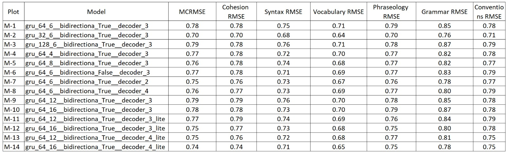

*Figure 6: Evaluation metrics of the RNN models*

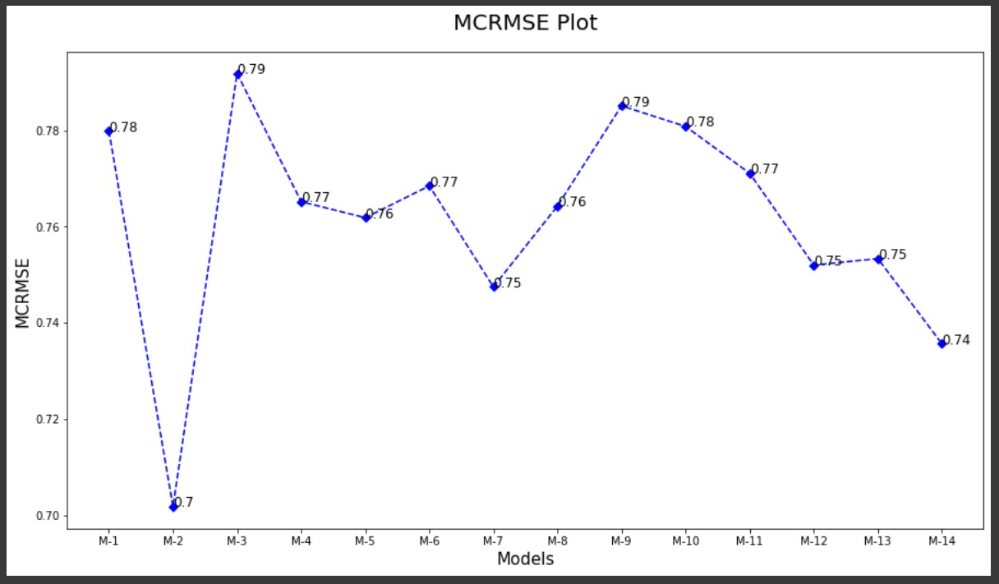

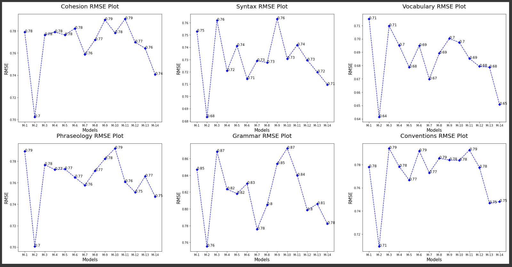

*Figures 7 & 8: Visualization of MCRMSE and RMSE of an individual score for RNN models*

We observed that M-2 consistently performs better than the other models for all measures. There are a few models that perform well only on a few measures (M-1, M-5, M-12, M-14) whereas a few models perform poorly for all measures (M-9, M-10). We can also see that all models perform well in evaluating syntax and vocabulary but struggle when evaluating Phraseology and Grammar.

### C. BERT-based models

**Approach-1**

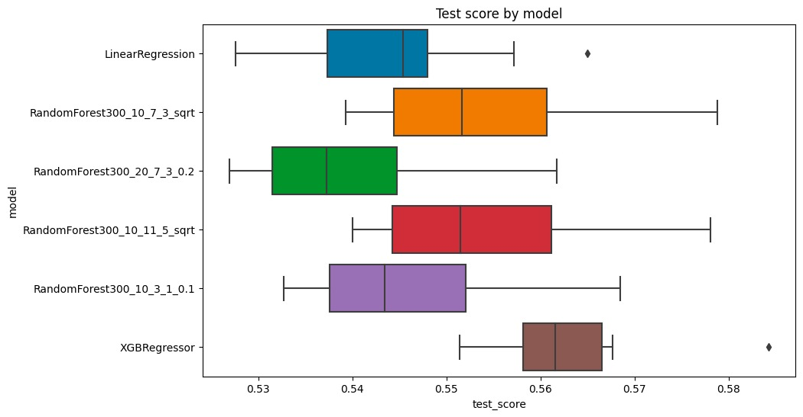

*Figure 9: 10-fold cross-validated MCRMSE for Linear and tree-based models*

One version of the Random Forest models achieved the highest performance, reaching an average MCRMSE of 0.5391, which was significantly better than both the best classical manually designed model and the best RNN-based model. 

Among different versions of random forest models, we found that more flexible models performed better. The best performing model had `max_depth=20` and `max_features=0.2` (153 features), compared to the alternative’s `max_depth=10` and `max_features` less than 76 features.

**Approach-2**

The results of the model iterations are shown below in the chart. The individual graph in the grid is a MCRMSE variation plot with epochs for a network model with a given learning rate.

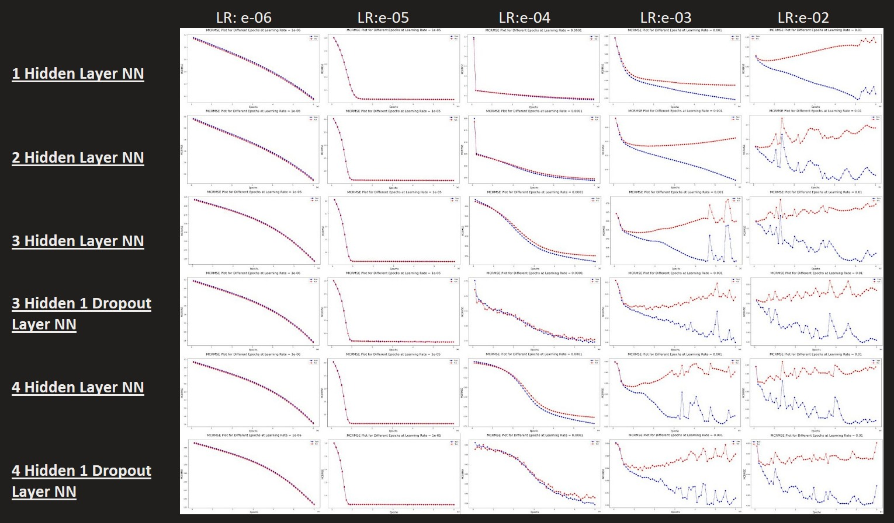

*Figure 10: MCRMSE plot with Epoch for a combination of BERT model and learning rate*

We observed that with an increase in learning rate on a logarithmic scale, the performance deteriorates from training to testing dataset for large epochs. It suggests that the model converges quickly and fails to capture all the patterns. Further, we noticed fluctuations in models with Dropout layers even in low learning rate iterations. As Dropout regularization layers randomly reduce neuron weights to zero, we saw fluctuation in metric value with increase in epochs.

Although the models above run for 600 epochs, we captured the model snapshots for epochs with lowest test MCRMSE. The results are as below:

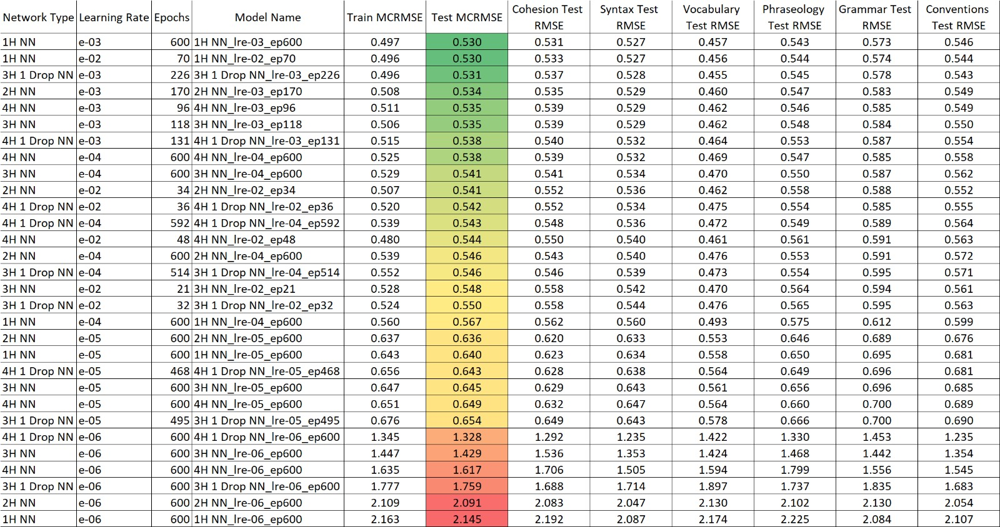

*Figure 11: Model performance comparison at epoch with lowest Test MCRMSE*

The top-3 models M-1 (1 Hidden layer, LR = e-03, epochs=300), M-2 (1 Hidden layer, LR = e-02, epochs=70) and M-3 (3 Hidden 1 Dropout layer, LR = e-03, epochs=226) almost have the same performance on the test set. We moved ahead with M-3 as it has a moderate number of epochs (less computationally expensive), moderate learning rate (model with LR= e-02 converges quickly), and a regularization component which is expected to give stable results.	

### Supervised models results discussion

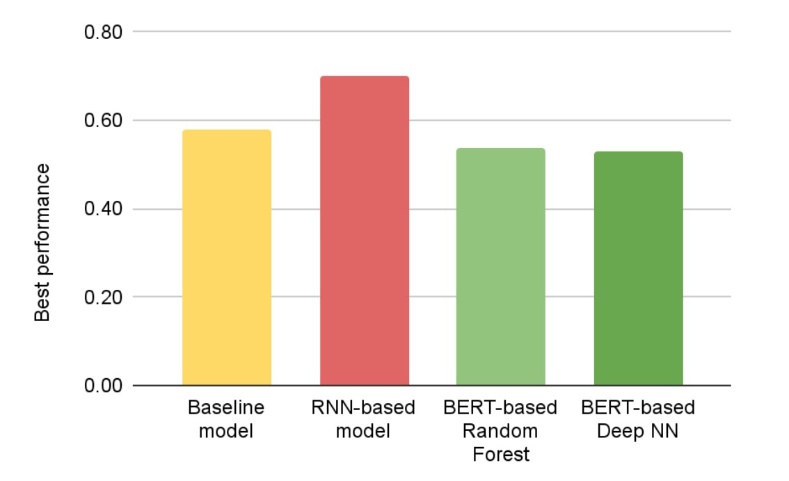

*Figure 11: Best performance of each model types*

Comparing different approaches, we clearly saw:
- BERT models performs best: Bi-directional interpretation of context is key
- RNN model surprising performs worse than traditional models
- Traditional (Baseline) models provide decent results: Owing to well-designed features

## 2. Unsupervised models results
We first trained a Hierarchical Clustering model with Complete Linkage on the predicted scores from the BERT model. We plotted a dendrogram for the model as shown below, and we decided to use a cutoff of six and to obtain two as the optimal number of clusters.

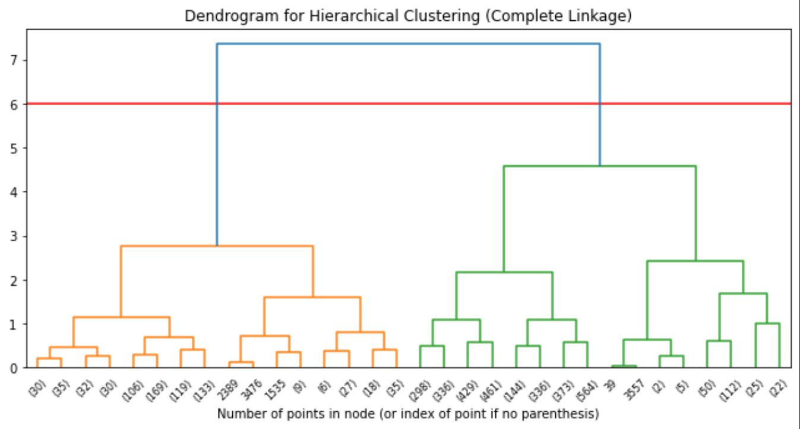

*Figure 12: Dendrogram for hierarchical clustering (Complete Linkage)*

We then decided to test the following types of models with two clusters: KMeans Clustering and Gaussian Mixture Model. To validate whether two clusters were appropriate for KMeans and GMM, we calculated Silhouette Coefficients and Davies-Bouldin Indexes for the results of KMeans and GMM at different numbers of clusters. Seeing the results below, Silhouette is highest for two clusters. However, Davies-Bouldin is also high. We decided to stick with two clusters because the benefit of an additional cluster is not significant according to the metrics.

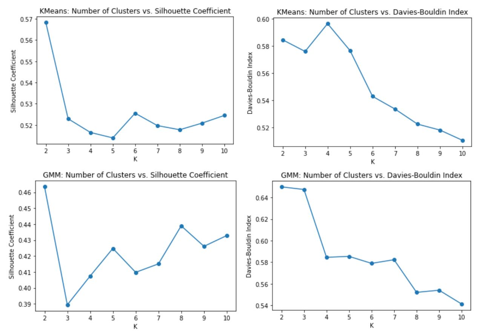

*Figure 13: Clustering Metrics for KMeans and GMM*

From the graphs above, we can also see that KMeans has a higher Silhouette Coefficient of 0.57 and a lower Davies-Bouldin Index of 0.58 than GMM at two clusters, indicating a better clustering performance. We found that the Hierarchical Model’s Silhouette Coefficient is 0.51 and Davies-Bouldin Index is 0.56, which indicates a similar clustering performance to KMeans. We decided to select the Hierarchical model because it provided the largest separation between low scoring writers and high scoring writers in terms of average score within each cluster.
 
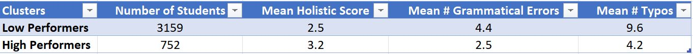

*Figure 14: Hierarchical Clustering Results*

The results of the clustering are shown above. We can see that the clusters divide the writers into low performers and high performers, with the former having an average score of 2.5 out of 5 and the latter having an average score of 3.2 out of 5. We also see that there are significantly more low performers than high performers. An interesting insight we found within these clusters is that the main issues that low performing writers have are grammatical errors and typos within their writing. These differences were highly significant as found with ANOVA tests comparing mean errors. While the other types of errors (defined by LanguageTools) had differences in the two clusters, grammatical errors and typos were the most major differences. This indicates that low performing writers need to improve in these two categories to score higher. English teachers can use this information to better teach their students and help the ones that are struggling the most.

We were not able to gain any additional insight from our clustering task because of the nature of the essay score data. As shown below, each essay score metric is highly correlated with one another. Writers that scored high in one metric tended to score high in the others, whether this is because of general language skill or due to scoring bias. This limited our ability to find many different clusters.

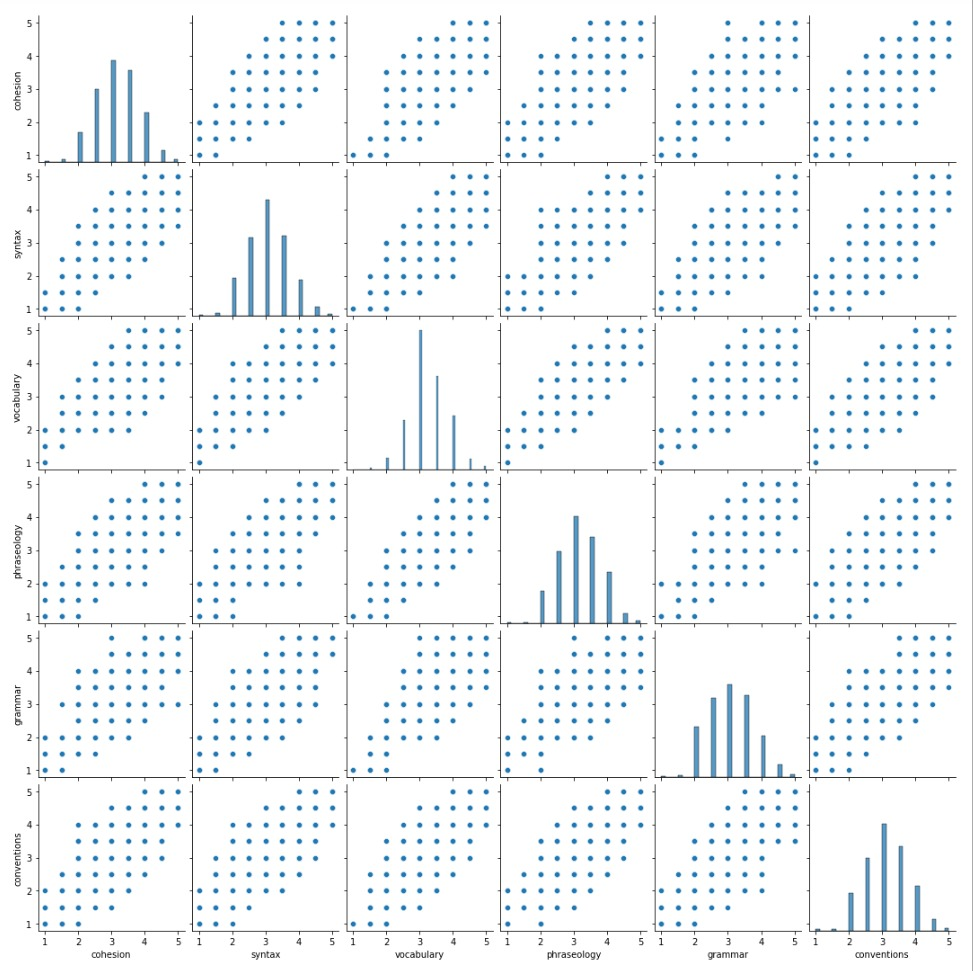

*Figure 15: Original Scores Pairs Plot*

# Conclusion

As expected, our BERT models performed better than our baseline model, but surprisingly our RNN model did not outperform our baseline despite being a more sophisticated approach. This may be due to well designed features in our traditional ML baseline or due to the comparatively small dataset available for training, since Neural Networks tend to require larger datasets in order to train properly.

As for our Unsupervised learning, it was very interesting to see the limitations and insights that this method yielded. While our clustering was ultimately only able to separate students into high and low performers, we were able to garner that the main features separating the two were grammatical errors and typos in their writing. This describes that there is some correlation between English language basics such as typographical and grammatical errors and overall performance, perhaps suggesting that when helping low-performing students teachers should focus on re-capping the basics instead of trying to catch-up to the rest of the class on more advanced issues.

We believe we could improve our baseline model in the future by investigating more features to extract from the data, and collecting information on what experts believe to be relevant features in the field. As for our RNN model, the encoder, including the word embeddings, had too many parameters which ultimately caused over-fitting. So, reducing the complexity of the encoder by freezing the word embedding layer or reducing the size of memory cell might help improve the performance significantly. More efforts putting into hyper parameters tuning might also yield good results. Finally, for our BERT-based, we could improve model performance by experimenting with more sophisticated decoder architecture. In particular, tapping directly into the context-aware word embeddings instead of having to go through the pooling layer that the Sentence Transformer library employed would reduce the amount of loss information significantly. One way to do that is building an RNN or a transformer model on top of the pre-trained BERT. More experimentation is needed on this front.

Ultimately, we believe that our learnings and models from this project use an interesting new approach to drive value in the classroom.

# Contribution table

All members contributed a similar amount of efforts.

| Phase | Name | Contribution |
| ----------- | ----------- | ----------- |
| Proposal | Tanmay | Literature review, Github page creation and editing |
| Proposal | Palash | Liternature review, Script writing and recording |
| Proposal | Kien | Literature review, Slide production for video, Github repository creation, proposal submission |
| Proposal | Duncan | Writing Introduction & Background, Problem Definition, References, Script writing and recording |
| Proposal | Lily | Writing Methods, and Potential Results & Discussion, final proof read, and project timeline planning and Gantt Chart |
| Progress Report | Tanmay | Data Collection, Baseline Model Development, Evaluation |
| Progress Report | Palash | Data Cleaning and Processing, Evaluation, writing report for the same parts |
| Progress Report | Kien | Building, training and experiments of the RNN-based models, writing report for the same parts |
| Progress Report | Duncan | Methods, Baseline Model Development |
| Progress Report | Lily | Methods, Baseline Model Development |
| Final Report | Tanmay | Clustering Model Development, Clustering Evaluation, Visualization, Report |
| Final Report | Palash | Research BERT sentence transformers; Build, train and experiments of NN models, Report|
| Final Report | Kien | Research Essay embedding pre-trained models, Develop framework and models, Report |
| Final Report | Duncan | Methods, Baseline Model Development, report, presentation |
| Final Report | Lily | Methods, Baseline Model Development, report, presentation |

# References: 

Ke, Z., & Ng, V. (2019). Automated Essay Scoring: A Survey of the State of the Art. IJCAI.

Devlin et al., NAACL (2019). BERT: Pre-training of Deep Bidirectional Transformers for Language Understanding

Wang et al., NAACL (2022). On the Use of Bert for Automated Essay Scoring: Joint Learning of Multi-Scale Essay Representation

Ruder et al., NAACL( 2019).Transfer Learning in Natural Language Processing

Feedback prize - english language learning. Kaggle. (2022). Retrieved October 6, 2022, from https://www.kaggle.com/competitions/feedback-prize-english-language-learning/overview/evaluation 

Vaswani et al. Arxiv. (2017). Attention Is All You Need

Mathias, S., & Bhattacharyya, P. (2018, May). ASAP++: Enriching the ASAP automated essay grading dataset with essay attribute scores. In Proceedings of the eleventh international conference on language resources and evaluation (LREC 2018)

The Hewlett Foundation: Automated essay scoring. Kaggle. (2012). Retrieved October 6, 2022, from https://www.kaggle.com/competitions/asap-aes/overview/evaluation

Reimers, Nils and Gurevych, Iryna (2019) Sentence-BERT: Sentence Embeddings using Siamese BERT-Networks. In Proceedings of the 2019 Conference on Empirical Methods in Natural Language Processing
