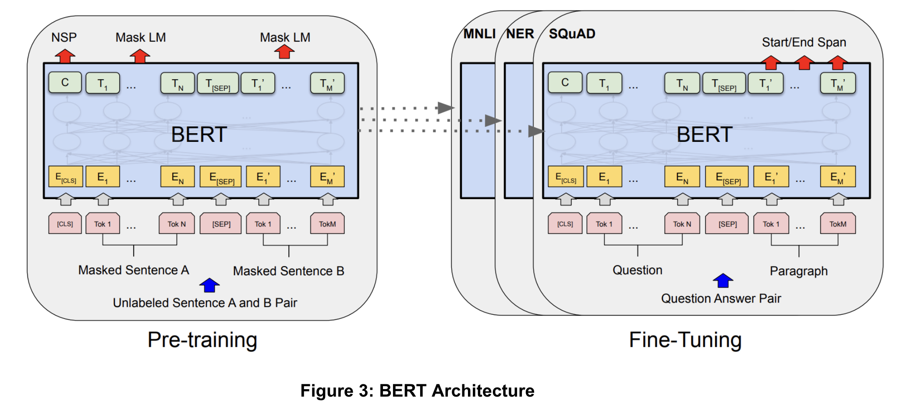

# Mid-term report

## Introduction

Essay scoring is a relevant and applicable usage of Machine Learning as it can tangibly save hours required to manually grade essays. 

***//Todo: Add literature review***

## Problem definition & Data collection

We are conducting our machine learning project on essay grading, based on a Kaggle competition where the goal is to evaluate the essays of 8th-12th grade English as second language learners. 

**Model Input**

Input for the models that we will build are the student's essays provided by the competition. The dataset contains 3911 essays with a mean of 461 words.

**Prediction output**

In accordance with the competition and its description, we will be predicting six analytic measures for each essay, namely: `cohesion`, `syntax`, `vocabulary`, `phraseology`, `grammar`, and `conventions`. 

## Methods

***//Todo: revamp this section. i.e. adapt to the fact that we built a few models, what is still relevant, what is not***

Our scoring algorithm will be particularly useful as it will score essays on specific dimensions, something that has lagged automatic “Holistic” or general scoring of essays. Our project is NLP(Natural Language Processing) focused, where we will utilize TR(Transfer Learning), and apply BERT(Bidirectional Encoder Representations from Transformers). TR means that we will reuse the pre-trained model and apply a new problem statement to it. NLP, as a branch of Artificial Intelligence, is making computers have the ability to process text like humans. Therefore, BERT stands out for our projects because BERT is a transformer-based technique for NLP applications. It is a pre-trained language model which helps machines learn excellent representations of text concerning the context in many natural language tasks. It utilizes a bidirectional encoder to contextualize the sentence from Left-to-Right and Right-to-Left. We plan to apply BERT as a pre-trained model and add downstream layers to predict the metric scores. 

Additionally, we will conduct a comparison between our main BERT model and several additional models including RNN (Recurrent Neural Network) based models and traditional ML models (e.g. Tree models, SVM (Support Vector Machine), etc.) with hand designed features to evaluate the efficacy of our main model. 

Once we’ve finished with developing our BERT model, we plan on clustering essays into different meaningful categories based on their scores in each of the analytic measures. This will not only provide us insight on the data, but also potentially give teachers a way to give more customized feedback to students even if they’re not directly involved in the scoring process.

Our final result will be two models: our BERT model, that will predict the six analytic measures as its output, as well as one that is able to perform clustering on the dataset, putting students into contextually meaningful clusters.

We will evaluate the performance of our Supervised model using the quadratic weighted kappa (an accuracy rating that accounts for chance) and the mean column wise root mean squared error, since it is the metric used for scoring in the competition. Additionally, we will evaluate the clusters generated by our clustering algorithm to ensure they are contextually relevant.

  

## Implementation, Result, and Discussion

At the point of Mid-term report, we have built several models using two approaches: 
1. Classical approach: Hand-picked features + traditional ml algorithms (Linear regression, Lasso, Gradient Boosted Tree)
2. RNN approach: Using Recurrent neural network to extract latent features and multi layer perceptrons (MLP) to predict score.

Trying these approaches before deep-diving on Transformer-based model have the following benefit:
- We understand better the task at hand (essay scoring) and its main challenges
- We understand what works well and what doesn't for the classical approach and the alternative approach, which provide good ideas for the transformer-based model

We will report the implementation, result, and discussion of each approaches separately. Then compare the two approach and discuss the implications for next steps.

### A. Classical approach
#### 1. Data pre-processing
***//Todo: Add content***

#### 2. ML model implementation
***//Todo: Add content***

#### 3. Results
***//Todo: Add content***

### B. RNN-based approach
#### 1. Data pre-processing
***//Todo: Add content***

#### 2. ML model implementation
***//Todo: Add content***

#### 3. Results
***//Todo: Add content***

## Project planning

## Contribution table

| Phase | Name | Contribution |
| ----------- | ----------- | ----------- |
| Proposal | Tanmay | |
| Proposal | Palash | |
| Proposal | Kien |  |
| Proposal | Duncan |  |
| Proposal | Lily |  |

  

## References

Ke, Z., & Ng, V. (2019). Automated Essay Scoring: A Survey of the State of the Art. IJCAI.

Devlin et al., NAACL (2019). BERT: Pre-training of Deep Bidirectional Transformers for Language Understanding

Wang et al., NAACL (2022). On the Use of Bert for Automated Essay Scoring: Joint Learning of Multi-Scale Essay Representation

Ruder et al., NAACL(2019).Transfer Learning in Natural Language Processing

Feedback prize - english language learning. Kaggle. (2022). Retrieved October 6, 2022, from https://www.kaggle.com/competitions/feedback-prize-english-language-learning/overview/evaluation 

Vaswani et al. Arxiv. (2017). Attention Is All You Need

Mathias, S., & Bhattacharyya, P. (2018, May). ASAP++: Enriching the ASAP automated essay grading dataset with essay attribute scores. In Proceedings of the eleventh international conference on language resources and evaluation (LREC 2018)

The Hewlett Foundation: Automated essay scoring. Kaggle. (2012). Retrieved October 6, 2022, from https://www.kaggle.com/competitions/asap-aes/overview/evaluation 
